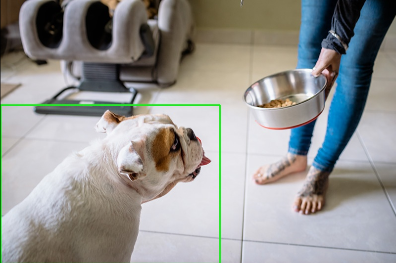

# CLIP

## 1. 模型获取

```shell
cd model
sh download_model.sh
```


## 2. DEMO

### 2.1 Python Demo

tokenizer下载：

```shell
sudo apt-get install git-lfs
git lfs install
git clone https://ai.gitee.com/hf-models/clip-vit-base-patch32
```

依赖安装:

```shell
cd python
sudo apt update && sudo apt upgrade -y
sudo apt install python3-pip
sudo apt install python3-virtualenv
virtualenv clip_env
pip install sympy==1.13.1 -i https://mirrors.aliyun.com/pypi/simple/   
pip install -r requirement.txt --index-url https://git.spacemit.com/api/v4/projects/33/packages/pypi/simple
pip install spacemit-ort --index-url https://git.spacemit.com/api/v4/projects/33/packages/pypi/simple
```

执行方法:

```shell
python test_clip.py --img ../data/dog.jpg  --text "dog"
# 其他重要参数
# --clipseg-model  clip模型路径
# --thr 类别阈值

```

执行结果:

<center>
    
    <br>
    <div style="color:orange; border-bottom: 1px solid #d9d9d9;
    display: inline-block;
    color: #999;
    padding: 2px;"> 图1 CLIP推理结果 </div>
</center>

接口说明：

```python
# 基础CLIP模型类
clipseg = CLIPSeg(args.clipseg_model)
# args.clipseg_model为CLIP模型路径
# 模型推理
prob = clipseg(img, args.text)  
# img为cv2.imread结果；args.text为输入时的文本
# 计算mask
prob = cv2.resize(prob, img.shape[1::-1], interpolation=cv2.INTER_LINEAR)
mask_bin = (prob > args.thr).astype(np.uint8)
# 计算得到最终结果
sel, box, point = largest_component(mask_bin)
# sel是最大连通区域的mask；box为目标的左上角，右下角坐标；point为目标的中心点坐标

```

