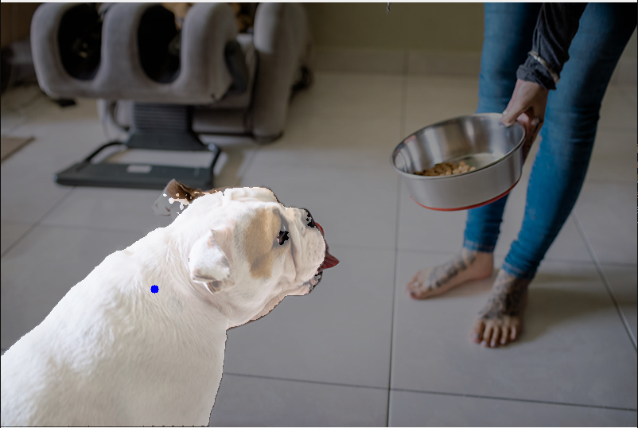
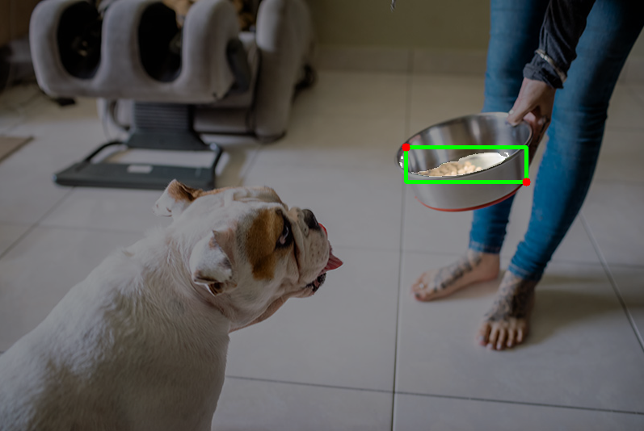

# SAM

## 1. 模型获取

```shell
cd model
sh download_model.sh
```


## 2. Demo

### 2.1 Python Demo

依赖安装：

```shell
cd python
sudo apt update && sudo apt upgrade -y
sudo apt install python3-pip python3-venv
python3 -m venv name(虚拟环境名) 
source name/bin/activate 
pip install -r requirements.txt --index-url https://git.spacemit.com/api/v4/projects/33/packages/pypi/simple
```

执行方法：

```shell
python test_sam.py --img ../data/dog.jpg
# 其他参数说明
#--vit-model encoder模型路径
#--decoder-model decoder模型路径
#--output 保存图片路径
```

执行结果:

可以使用鼠标左键点击物体分割，按s保存图片。

<center>
    
    <br>
    <div style="color:orange; border-bottom: 1px solid #d9d9d9;
    display: inline-block;
    color: #999;
    padding: 2px;"> 图1 左键单点分割 </div>
</center>

右键点击2个点画框分割

<center>
    
    <br>
    <div style="color:orange; border-bottom: 1px solid #d9d9d9;
    display: inline-block;
    color: #999;
    padding: 2px;"> 图2右键两点画框分割 </div>
</center>

接口说明：

```shell
# 基础SAM预测类
predictor = SamPredictor(args.vit_model, 
                         args.decoder_model,
                         args.warmup)
# args.vit_model为encoder模型；args.decoder_model为decoder模型；args.warmup为预热推理次数，默认为0

# 推理图像特征注册
predictor.register_image(img)
# img为imread得到得到的结果

# SAM推理获取mask
 mask = predictor.get_mask(points,point_labels,boxes,mask_input)
# points为点坐标，根据点坐标分割物体；point_labels 点坐标的label，区分前景和背景；boxes为两个点的坐标，一般认为是左上和右下的坐标，然后画框分割物体；mask_input为输入的mask值，辅助分割图像。

得到mask后经过后处理得到最终结果
```

