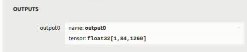
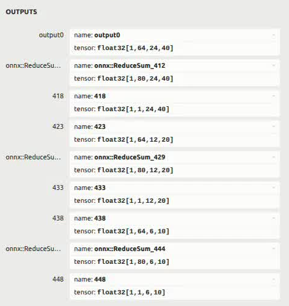

# YOLOv8

## 1. 模型和数据获取

### 1.1 模型导出

官方onnx模型导出，可以参考[Ultralytics官方导出文档](https://docs.ultralytics.com/zh/modes/export/#introduction)。

### 1.2 模型获取

```shell
cd model
sh download_model.sh
```

下载模型保存为yolov8n_192x320.q.onnx,yolov8n_320x320.q.onnx。(都是非官方模型量化后的模型)


### 1.3 数据获取

```shell
cd data
sh download_data.sh
```

执行完后会在当前目录下载测试图片test.jpg和标签文件label.txt。


## 2. 模型量化

如果用1.1中的INT8模型，可跳过该步骤。

**Note**:注意请在x86平台就行模型量化

###  2.1 量化步骤

可参照该教程完成量化：https://bianbu.spacemit.com/brdk/Advanced_development/6.1_Model_Quantization

### 2.2 官方模型量化

参照2.1即可

(1,84,2100)中84维度中0-3为未还原的左上角，右下角坐标，4-83为每个类的得分值；2100为框的数量。

<center>
    
    <br>
    <div style="color:orange; border-bottom: 1px solid #d9d9d9;
    display: inline-block;
    color: #999;
    padding: 2px;"> 图1 官方onnx模型输出(模型输入192*320) </div>
</center>

### 2.3 非官方模型量化

我们非常推荐使用这种方式量化，量化脚本为molde/xquant_config.json。

下图为非官方模型(模型输入的输出结果：

([1,64,24,40],[1,80,24,40],[1,1,24,40])代表在一个检测头上的为经过dfl的框坐标，框的每个类的概率，框所有类概率总和。

<center>
    
    <br>
    <div style="color:orange; border-bottom: 1px solid #d9d9d9;
    display: inline-block;
    color: #999;
    padding: 2px;"> 图2 非官方onnx模型输出（模型输入192*320) </div>
</center>

### 2.4 相关资源

[Calibration数据下载](https://archive.spacemit.com/spacemit-ai/BRDK/Model_Zoo/Datasets/Coco/Coco.tar.gz)


## 3. Demo


### 3.1 python demo

依赖安装：

```shell
cd python
sudo apt install python3-pip python3-venv
python3 -m venv name(虚拟环境名) 
source name/bin/activate 
pip install -r requirements.txt --index-url https://git.spacemit.com/api/v4/projects/33/packages/pypi/simple
```

执行方法:

```shell
python test_yolov8.py

# 参数说明
#--model 模型具体路径(默认为../model/yolov8n.q.onnx)  
#--image 测试图片路径（默认为../data/test.jpg）
#--use-camera 是否使用摄像头（需要摄像头时带上此参数）
#--conf-threshold 置信度阈值(可选)
#--iou-threshold IOU阈值(可选)

# 如需迁移代码，注意utils.py中标签文件默认为../data/label.txt.
```

结果保存为result.jpg

### 3.2 c++ demo

依赖安装：

```shell
sudo apt install libopencv-dev
```

执行方法：

```shell
cd cpp
mkdir build
cd build
cmake ..
make -j8
./yolov8_demo --model onnx模型路径 --image 图片路径
# 注意main.cc中labelFilePath的路径是否正确，默认是../../data/label.txt(要以build目录为基准路径)
```

结果保存为result.jpg。
